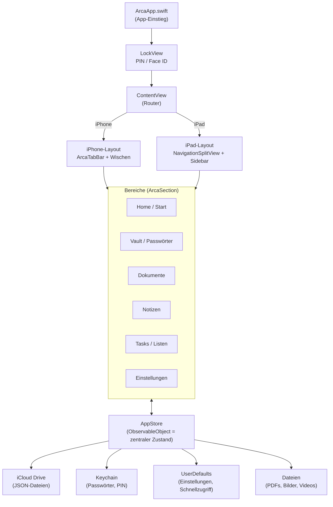
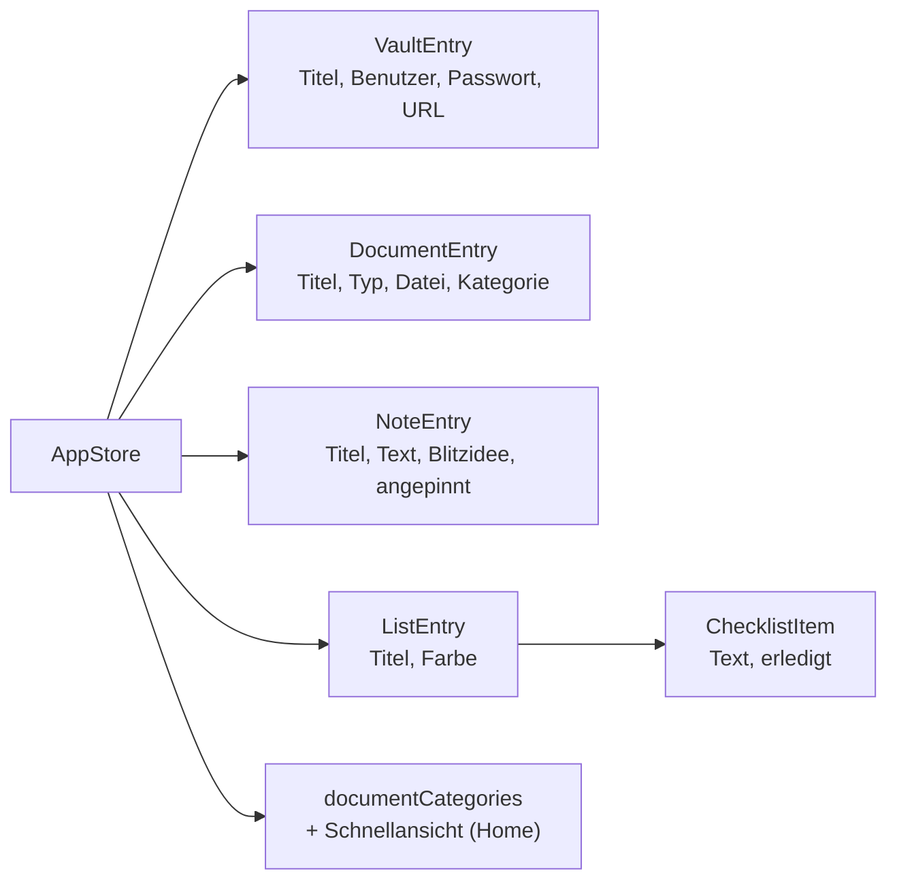
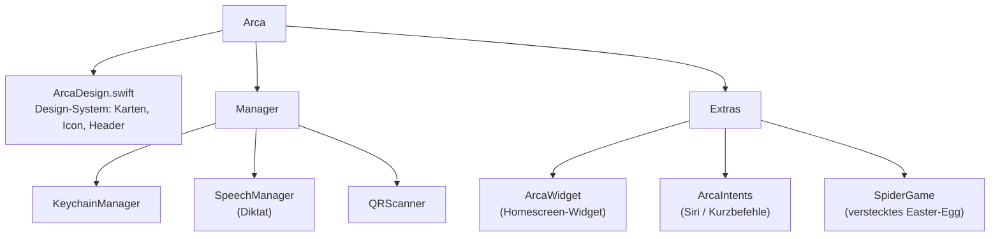

# Arca – Architektur

Übersicht über den Aufbau der App **Arca** (Version 2.4.0).
Die Diagramme sind in [Mermaid](https://mermaid.js.org) geschrieben und werden
direkt in **Obsidian** (Lesemodus) sowie auf **GitHub** als Grafik dargestellt.

---

## 1. App-Aufbau & Datenfluss

---

## 2. Datenmodell (Models.swift)

---

## 3. Unterstützende Bausteine

---

## Kurz zusammengefasst

- **Einstieg:** `ArcaApp` → Sperre (`LockView`) → `ContentView` als Weiche zwischen
  **iPhone** (Tab-Leiste) und **iPad** (Sidebar / Split View).
- **6 Bereiche:** Start, Passwörter, Dokumente, Notizen, Tasks, Einstellungen.
- **Herzstück:** der `AppStore` – hält alle Daten und speichert sie verschlüsselt in
  **iCloud, Keychain, UserDefaults** und als **Dateien**.
- **Drumherum:** Design-System, Manager (Keychain / Diktat / QR), Widget,
  Siri-Intents und das versteckte Spiel.

---

## Dateiübersicht

| Datei | Aufgabe |
|-------|---------|
| `arca/ArcaApp.swift` | App-Einstiegspunkt |
| `arca/LockView.swift` | Sperrbildschirm (PIN / Face ID), Glas-Icon |
| `arca/ContentView.swift` | Haupt-UI & Router, fast alle Ansichten |
| `arca/AppStore.swift` | Zentraler Zustand & Persistenz (iCloud / Keychain) |
| `arca/Models.swift` | Datenmodelle (Vault, Dokument, Notiz, Liste …) |
| `arca/ArcaDesign.swift` | Design-System (Karten, Icon-Kacheln, Header) |
| `arca/KeychainManager.swift` | Sicheres Speichern von Passwörtern & PIN |
| `arca/SpeechManager.swift` | Diktat / Sprache-zu-Text |
| `arca/QRScanner.swift` | QR-Code-Scanner |
| `arca/SpiderGame.swift` | Verstecktes Mini-Spiel (Easter-Egg) |
| `arca/ArcaIntents.swift` | Siri / Kurzbefehle |
| `ArcaWidget/ArcaWidget.swift` | Homescreen-Widget |

---

*Entwickler: Hans zen Ruffinen · Stand: Version 2.4.0 (Build 31)*
