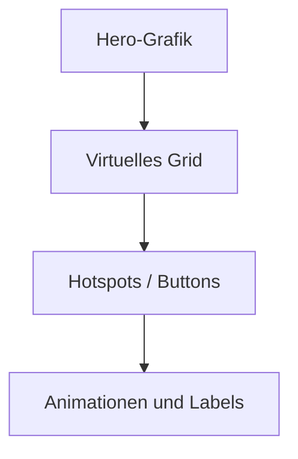

# Navigationsgitter

Quelle Konzept: Desktop-Dokument *ARCA_Hero_Navigation_Konzept_Cursor_Claude.docx* (importiert).

Siehe auch: [[Hero-Grafiken]] · [[Hotspot-Spezifikation]] · [[Debug-Modus]] · [[Vault-Link]]

---

## Ziel

Für **ARCA Ticket** und **ARCA Holiday** soll über der Hero-Grafik ein virtuelles Navigationsgitter liegen. Die Hintergrundgrafik bleibt unverändert, während Hotspots und Buttons darüber positioniert werden.

## Konzept – Ebenen

1. Hero-Grafik
2. Virtuelles Grid
3. Hotspots / Buttons
4. Animationen und Labels

## Anforderungen

- Safe Areas berücksichtigen (Dynamic Island, Home Indicator)
- Responsive Positionierung
- **Relative Koordinaten** statt Pixel (normalisiert 0…1)
- Jeder Hotspot besitzt **ID**, **Titel** und **Position**
- Debug-Modus zum Ein-/Ausblenden des Grids → [[Debug-Modus]]

## Beispiel-Hotspots (Konzept)

- Ticket
- Boarding Card
- Pass
- Koffer
- Golf
- Notizen
- Taxi
- Hotel
- Dokumente

## SwiftUI-Idee

- `NavigationHotspot` mit relativen x/y-Koordinaten
- `GeometryReader` für responsive Positionierung
- `ZStack`: Hintergrundbild → Grid → Buttons

## Debug-Modus (Konzept)

| `showGrid` | Raster | Hotspots |
|---|---|---|
| `true` | sichtbar | aktiv |
| `false` | unsichtbar | weiterhin aktiv |

## Projektablauf

1. Hero-Bild anzeigen
2. Virtuelles Grid einbauen
3. Hotspots positionieren
4. Klick testen
5. Navigation mit echten ARCA-Ansichten verbinden
6. Animationen und Feinschliff ergänzen

## Langfristige Vision

Die Illustration selbst wird zur Navigation. Nutzer tippen direkt auf Flugzeug, Pass, Koffer oder Golfball — eine einzigartige, spielerische Oberfläche.

> [!tip] Vault
> Story und Journal zu dieser Vision liegen im Obsidian-Vault: [[Vault-Link]]

---

## Ist-Stand im Code

> [!note] Stand Repo
> Das Konzept ist teilweise umgesetzt: relative Hotspots existieren; ein sichtbares Debug-Raster ist noch nicht einheitlich ausgebaut (siehe [[Debug-Modus]]).

### ARCA Tickets – Unterwägs / Ferien-Grafik

**Datei:** `ArcaTickets/UnterwegsHeroIllustrationView.swift`

- Zwei Modi: `UnterwegsViewMode.plakatwand` (Glas-Plakatwand) vs. `.ferienGrafik`
- Ferien-Einstieg: `UnterwegsFerienEinstiegView` mit Asset `UnterwegsHeroIllustration`
- Hotspots: `UnterwegsHeroHotspot` — normalisierte Punkte/Größen (0…1), unsichtbar, mit Accessibility-Hints
- Aktionen: Klecks auf Plakatwand-Anker (`UnterwegsSceneAnchor`) oder Weiter zu Tickets
- Plakatwand-Geometrie/Anker: `ArcaTickets/TravelSceneGraphic.swift`

### ARCA Holiday

**Datei:** `ArcaTickets/ArcaHolidayView.swift`

- Vertikaler Hero (`ArcaHolidayHero`, Aspekt ≈ 473×1024)
- Klecks-Map: `ArcaHolidayKleck` (Golf, Taxi, Koffer, Pass, Notizen, Boarding Card)
- Unsichtbare Hotspots + Ripple-Feedback; Sheets für Notizen, Koffer, Taxi, Boarding, …

### ARCA Pet

**Datei:** `ArcaPet/ArcaPetHomeView.swift`

- Holiday-ähnliches Muster: Hero `ArcaPetHero` + Kategorie-Hotspots
- Zusätzlicher Add-Pet-Hotspot (`ArcaPetAddPetHotspot` in `ArcaPet/Models.swift`)

### Asset-Pfade

Siehe [[Hero-Grafiken]].
