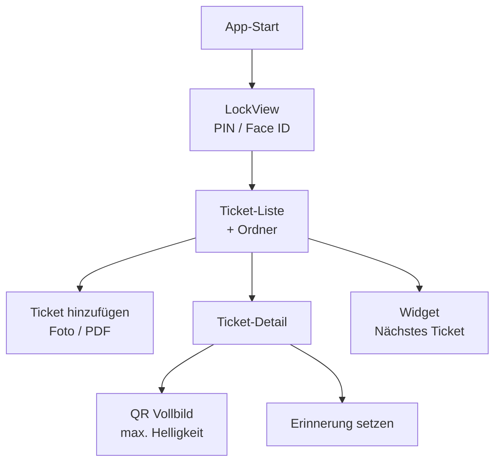
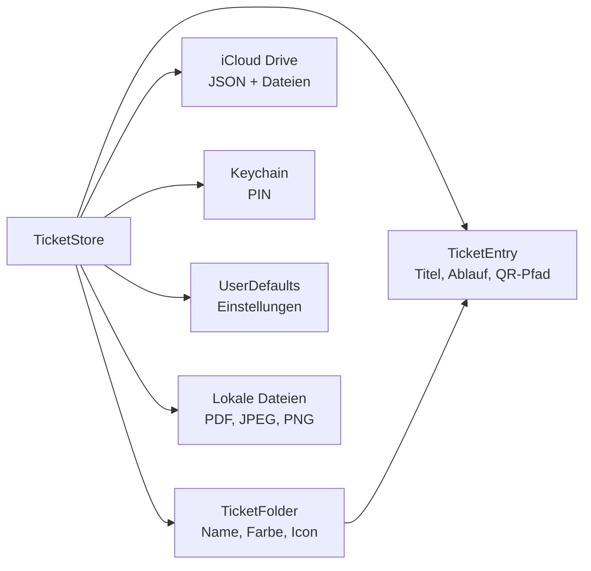
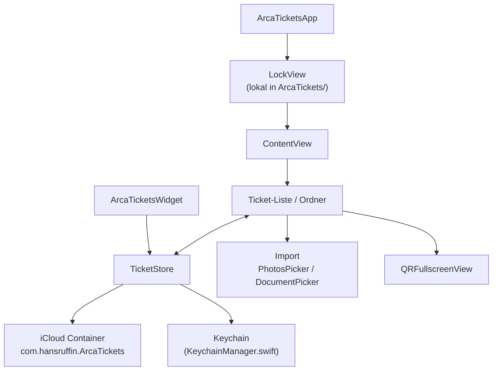

# Arca Tickets

> [!note] Verwandtes Projekt
> Arca Tickets ist ein schlanker Ableger von [[Arca]] — fokussiert auf Fahrkarten und digitale Tickets, ohne Vault, Notizen oder Tasks.

#Arca #ArcaTickets #Produkt

---

## In Xcode starten

> [!important] Kein separates Projekt
> Arca Tickets liegt **nicht** in `ArcaTickets.xcodeproj` (gibt es nicht), sondern als **eigenes Target** im bestehenden **`Arca.xcodeproj`**.

1. **`Arca.xcodeproj`** öffnen (nicht nur den Ordner `arca/` oder `ArcaTickets/`)
2. Oben links im Scheme-Dropdown **`ArcaTickets`** wählen (nicht „Arca“)
3. Simulator wählen, z. B. **iPhone 17**
4. **⌘R** zum Bauen und Starten

**Projektstruktur auf der Platte:**

```
Arca/
├── arca/                    ← Haupt-App Arca
├── ArcaTickets/             ← Swift-Quellen, Assets, Info.plist
├── Arca.xcodeproj           ← beide Apps in einem Projekt
│   └── xcshareddata/xcschemes/
│       ├── Arca.xcscheme
│       └── ArcaTickets.xcscheme
└── docs/Arca-Tickets.md
```

**Scheme fehlt?** Scheme-Dropdown → **Manage Schemes…** → **ArcaTickets** aktivieren (Häkchen „Shared“).

**Build auf echtem iPhone schlägt fehl?** Siehe Abschnitt [iCloud Developer Portal](#icloud-developer-portal-echtes-gerät) unten. Im **Simulator** funktioniert der Build ohne dieses Setup.

---

## iCloud Developer Portal (echtes Gerät)

> [!important] Pflicht für Geräte-Build
> Ohne diese Schritte schlägt der Build auf einem echten iPhone fehl (Provisioning / Entitlements).

### 1. App-ID anlegen

1. [developer.apple.com](https://developer.apple.com) → **Certificates, Identifiers & Profiles** → **Identifiers**
2. **+** → **App IDs** → **App**
3. **Description:** `Arca Tickets`
4. **Bundle ID:** `com.hansruffin.ArcaTickets` (Explicit)
5. Capabilities aktivieren:
   - **iCloud** → Include CloudKit support: **nein** → nur **iCloud Documents**
   - Container: `iCloud.com.hansruffin.ArcaTickets` (neu anlegen oder bestehend wählen)
   - **App Groups** → `group.com.hansruffin.ArcaTickets` (für Widget)
6. **Register**

### 2. Widget Extension App-ID

1. Weitere App-ID: `com.hansruffin.ArcaTickets.ArcaTicketsWidget`
2. Capabilities: **App Groups** → dieselbe Gruppe `group.com.hansruffin.ArcaTickets`
3. **Register**

### 3. iCloud Container

1. **Identifiers** → Filter **iCloud Containers**
2. Container `iCloud.com.hansruffin.ArcaTickets` anlegen (falls noch nicht vorhanden)
3. In der App-ID `com.hansruffin.ArcaTickets` unter iCloud diesem Container zuweisen

### 4. App Group

1. **Identifiers** → Filter **App Groups**
2. Gruppe `group.com.hansruffin.ArcaTickets` anlegen
3. Sowohl Haupt-App als auch Widget-Extension dieser Gruppe zuweisen

### 5. Provisioning in Xcode

1. `Arca.xcodeproj` öffnen → Target **ArcaTickets** → **Signing & Capabilities**
2. Team **LE6TQB8QE5** wählen, **Automatically manage signing** aktiv
3. Prüfen: iCloud Container + App Group erscheinen ohne Fehler
4. Gleiches für Target **ArcaTicketsWidget**
5. iPhone verbinden, Scheme **ArcaTickets**, **⌘R**

### 6. Häufige Fehler

| Fehler | Lösung |
|--------|--------|
| „iCloud container not found" | Container im Portal anlegen und App-ID zuweisen |
| Widget zeigt keine Daten | App Group in beiden Targets identisch; App einmal öffnen |
| „Failed to register bundle identifier" | Bundle ID im Portal exakt wie in Xcode |

---

## Killer-App-Positionierung

**Das schnellste Ticket in der Tasche — speichern, vorzeigen, rechtzeitig erinnert.**

Arca Tickets ist bewusst **klein und fokussiert**: keine Reiseplanung, kein Wallet-Export, kein OCR. Stattdessen drei Momente, in denen jede andere App zu langsam ist:

| Moment | Killer-Feature | Warum es zählt |
|--------|----------------|----------------|
| **Am Schalter** | QR/Barcode-Vollbild mit max. Helligkeit, Wisch zum Schließen | Scanner muss sofort lesen — kein Zoomen, kein Suchen |
| **Unterwegs** | Nächstes Ticket als Hero-Karte + „Am Schalter zeigen" | Ein Tap statt Ordner durchsuchen |
| **Vor Ablauf** | Lokale Erinnerung 1 Tag vorher | Ticket vergessen = Geld verloren |

**Differenzierung gegenüber Wallet & Konkurrenz:** PDF-Tickets, Screenshots und Fremdanbieter-QR-Codes, die Apple Wallet nicht kennt — plus schneller Import per Teilen und PIN/Face-ID-Schutz.

---

## Produktvision

**Alle Fahrkarten und Tickets an einem Ort — schnell abrufbar, sicher gespeichert, rechtzeitig erinnert.**

Arca Tickets ist eine dedizierte iOS-App für Reisende und Eventbesucher: Foto oder PDF importieren, in Ordner sortieren, QR-Code im Vollbild vorzeigen — ohne den Overhead der vollständigen [[Arca]]-Produktivitäts-Suite.

---

## Killer-Features (v1 — implementiert)

| # | Feature | Status | Beschreibung |
|---|---------|--------|--------------|
| 1 | **QR/Barcode Vollbild** | ✅ | Vision-Erkennung (QR, Aztec, Code128 …), Helligkeit 100 %, Wisch nach unten zum Schließen, Button „Am Schalter zeigen" prominent im Detail |
| 2 | **Schnell hinzufügen** | ✅ | Prominenter FAB „Hinzufügen", Dokumenttypen (PDF/Bild) für Import aus anderen Apps, `.onOpenURL`-Handler |
| 3 | **Nächstes Ticket** | ✅ | Hero-Karte auf dem Homescreen — baldigst ablaufendes gültiges Ticket oben |
| 4 | **Ablauf-Erinnerung** | ✅ | Lokale Push 1 Tag vor Ablauf (`UserNotifications`) |
| 5 | **Deutsche UI** | ✅ | Durchgängig deutsche, freundliche Texte |
| 6 | **Onboarding** | ✅ | 3 Screens beim ersten Start (überspringbar): Speichern → QR zeigen → Fertig |
| 7 | **App Icon** | ✅ | Arca-Familien-Icon: Glass-Ticket mit A-Logo, QR-Motiv & Dark-Mode-Variante |
| 8 | **Homescreen-Widget** | ✅ | Nächstes gültiges Ticket — Titel, Ordner, Countdown, QR-Hinweis |
| 9 | **Ordner verwalten** | ✅ | Eigene Ordner anlegen, umbenennen, löschen |
| 10 | **Filter Aktiv/Abgelaufen** | ✅ | Segment-Filter in Ordneransicht |
| 11 | **Haptik** | ✅ | Beim Speichern und „Am Schalter zeigen" |
| 12 | **Teilen-Import** | ✅ | PDF/Bild per Teilen-Sheet + URL-Scheme `arcatickets://` |

---

## Zielgruppe

| Segment | Bedarf |
|---------|--------|
| **Pendler & Vielflieger** | Bahn-, Flug- und Bus-Tickets schnell am Schalter vorzeigen |
| **Konzert- & Sportfans** | Event-Tickets mit QR-Code, Ablaufdatum im Blick |
| **Gelegenheitsreisende** | Einfache App ohne Lernkurve — kein Passwort-Manager nötig |
| **Bestehende Arca-Nutzer** | Leichtgewichtige Alternative, wenn nur Tickets gebraucht werden |

> [!tip] Positionierung
> Nicht konkurrieren mit Wallet (Apple Pay) — sondern ergänzen: PDF-Tickets, Screenshots, Fremdanbieter-QR-Codes, die Wallet nicht unterstützt.

---

## MVP-Features (v1)

| Feature | Beschreibung | Priorität |
|---------|--------------|-----------|
| **Ticket hinzufügen** | Foto (Kamera/Galerie) oder PDF importieren | 🔴 Must-have |
| **Ordner** | Tickets nach Reise, Event oder eigenen Kategorien gruppieren | 🔴 Must-have |
| **QR Vollbild** | Erkannten oder eingebetteten QR-Code fullscreen, hohe Helligkeit | 🔴 Must-have |
| **Ablauf-Erinnerungen** | Lokale Push-Benachrichtigung X Stunden/Tage vor Gültigkeitsende | 🔴 Must-have |
| **Widget** | Nächstes Ticket auf dem Homescreen (Titel, Countdown, Schnellzugriff) | 🟡 Should-have |
| **PIN / Face ID** | App-Sperre über Keychain (wie [[Arca]]) | 🔴 Must-have |
| **iCloud Sync** | Tickets und Metadaten geräteübergreifend synchronisieren | 🔴 Must-have |

---

## Explizit NICHT in v1

> [!warning] Scope-Grenze
> Alles, was Arca Tickets schlank hält, kommt bewusst später oder gar nicht.

- ❌ Passwort-Vault / Tresor
- ❌ Notizen, Tasks, Listen
- ❌ KI-Features / Diktat
- ❠️ Siri / Kurzbefehle (v2)
- ❌ Ticket-Kauf oder Integration mit Bahn-/Flug-APIs
- ❌ Automatische Kalender-Synchronisation (v2)
- ❌ iPad-optimiertes Split-View-Layout (v1 nur iPhone-first)
- ❌ Android / Web
- ❌ Teilen von Tickets mit anderen Nutzern
- ❌ OCR / automatische Felderkennung (Reisedatum, Sitzplatz) — v2

---

## UI-Skizze

### Hauptansicht (iPhone)

```
┌─────────────────────────────┐
│  🔒  Arca Tickets      ⚙️   │
├─────────────────────────────┤
│  📁 Alle Tickets            │
│  ├─ 🚆 Zürich–Bern  05.07.  │
│  ├─ ✈️  TXL→FCO     12.07.  │
│  └─ 🎫 Konzert       20.07.  │
│                             │
│  📁 Reise Sommer 2026       │
│  └─ 🚌 Bus Pass      01.08.  │
│                             │
│         ┌─────────┐         │
│         │    ＋    │         │
│         └─────────┘         │
└─────────────────────────────┘
```

### Ticket-Detail → QR Vollbild

```
┌─────────────────────────────┐
│  ←  SBB Zürich–Bern           │
├─────────────────────────────┤
│                             │
│      ┌───────────────┐      │
│      │  ▓▓▓ QR ▓▓▓   │      │
│      │  ▓▓▓▓▓▓▓▓▓▓▓   │      │
│      │  ▓▓▓▓▓▓▓▓▓▓▓   │      │
│      └───────────────┘      │
│                             │
│  Gültig bis: 05.07. 23:59   │
│  [  Vollbild QR anzeigen  ] │
└─────────────────────────────┘
```

### Navigationsfluss (Mermaid)



---

## Technische Architektur

> [!note] Wiederverwendung aus [[Arca]]
> Arca Tickets teilt sich ein **ArcaCore**-Framework mit der Haupt-App. Kein Copy-Paste — gemeinsame Bausteine als Swift Package oder Xcode Framework Target.

### Bundle & Targets

| Eigenschaft | Wert |
|-------------|------|
| **Bundle ID** | `com.hansruffin.ArcaTickets` |
| **Widget Bundle ID** | `com.hansruffin.ArcaTickets.ArcaTicketsWidget` |
| **Team** | LE6TQB8QE5 (wie [[Arca]]) |
| **Plattform** | iOS (iPhone-first), Deployment Target analog Arca |
| **Sprache** | Swift 5, SwiftUI |

### ArcaCore — gemeinsame Bausteine

| Modul (aus [[Arca]]) | Nutzung in Arca Tickets |
|----------------------|-------------------------|
| `ArcaDesign.swift` | Karten, Icon-Kacheln, Header, Farbsystem |
| `KeychainManager.swift` | PIN-Speicherung, sichere Metadaten |
| `LockView.swift` | App-Sperre (PIN / Face ID) |
| iCloud-Persistenz-Muster | JSON-Metadaten + Datei-Assets in iCloud Container |
| Widget-Infrastruktur | Timeline Provider, App Group |

### Projektstruktur (Ist-Stand MVP)

Arca Tickets ist ein **Target in `Arca.xcodeproj`**, kein eigenes Xcode-Projekt.

```
Arca/
├── arca/                        ← Arca Haupt-App
├── ArcaTickets/                 ← Arca Tickets App (Target: ArcaTickets)
│   ├── ArcaTicketsApp.swift
│   ├── TicketStore.swift        ← ObservableObject, iCloud
│   ├── Models.swift
│   ├── ContentView.swift, HomeView.swift, FolderView.swift
│   ├── TicketDetailView.swift, QRFullscreenView.swift, AddTicketView.swift
│   ├── LockView.swift, KeychainManager.swift
│   ├── OnboardingView.swift, NotificationManager.swift, SettingsView.swift
│   ├── WidgetDataUpdater.swift, TicketsHaptics.swift
│   ├── ArcaTicketsDesign.swift, Assets.xcassets, ArcaTicketsInfo.plist
│   └── ArcaTickets.entitlements
├── ArcaTicketsWidget/           ← Homescreen-Widget
└── ArcaWidget/                  ← nur für Arca
```

### Datenmodell (v1)



### Datenfluss



### iCloud Container

- Separater Container: `iCloud.com.hansruffin.ArcaTickets`
- Kein Datenaustausch mit `com.hansruffin.Arca` — eigenständige App, optional später Export/Import

---

## App Store Positionierung

### Metadaten

| Feld | Inhalt |
|------|--------|
| **Name** | Arca Tickets |
| **Untertitel** | Fahrkarten & Tickets griffbereit |
| **Kategorie** | Reisen |
| **Keywords** | ticket,fahrkarte,bahn,flug,qr,reise,zug,event,konzert,wallet,boarding pass |

### Kurzbeschreibung (DE)

Speichere Fahrkarten und Event-Tickets als Foto oder PDF. QR-Code im Vollbild, Ablauf-Erinnerungen und iCloud-Sync — sicher und übersichtlich.

### App Store Beschreibung (DE)

**Das schnellste Ticket in der Tasche.**

Arca Tickets hält deine digitalen Fahrkarten und Event-Tickets an einem Ort — ohne Wallet-Overhead, ohne Reiseplaner, ohne Schnickschnack.

**Speichern in Sekunden**
Foto, PDF oder Screenshot importieren. Per Teilen aus Mail oder Safari direkt in Arca Tickets. Ordner für Bahn, ÖV, Events und eigene Kategorien.

**Am Schalter sofort bereit**
QR-Code im Vollbild mit maximaler Helligkeit. Ein Tap — fertig. Kein Zoomen, kein Suchen in der Galerie.

**Rechtzeitig erinnert**
Push-Benachrichtigung einen Tag vor Ablauf. Dein Ticket vergisst du nicht — dein Geld auch nicht.

**Sicher & synchron**
PIN oder Face ID schützen deine Tickets. iCloud synchronisiert alles zwischen deinen Geräten.

**Widget auf dem Homescreen**
Das nächste gültige Ticket immer im Blick — mit Countdown und Schnellzugriff.

Arca Tickets ist die schlanke Schwester von Arca: nur Tickets, nichts Überflüssiges. Perfekt für Pendler, Vielflieger und alle, die unterwegs schnell vorzeigen müssen.

---

## Roadmap

### Phase 0 — Konzept & Setup
- [x] Produktkonzept dokumentieren
- [ ] ArcaCore aus [[Arca]] extrahieren
- [x] Xcode-Target `ArcaTickets` in `Arca.xcodeproj` anlegen (+ Shared Scheme)
- [x] App Icon & Branding (Arca-Familie)

### Phase 1 — Killer App MVP (v1.0)
- [x] TicketStore + Models
- [x] Import: Foto & PDF (+ Dokumenttypen / Teilen)
- [x] Ordner-Verwaltung (Standard-Ordner)
- [x] QR/Barcode-Erkennung & Vollbild-Ansicht (Vision, Wisch-Dismiss)
- [x] Ablauf-Erinnerungen (1 Tag vorher, UNUserNotificationCenter)
- [x] Nächstes Ticket Hero-Karte
- [x] Onboarding (3 Screens)
- [x] LockView + Keychain
- [x] iCloud Sync
- [x] Homescreen-Widget (nächstes Ticket)
- [x] Ordner verwalten & Filter
- [ ] TestFlight Beta

### Phase 2 — v1.x
- [ ] Siri / Kurzbefehle („Zeig mein nächstes Ticket")
- [ ] Kalender-Integration (Ablaufdatum → Event)
- [ ] iPad-Layout (NavigationSplitView)
- [ ] OCR: automatische Erkennung von Datum & Route
- [ ] App Store Launch

### Phase 3 — v2+
- [ ] Live-Aktivitäten (Countdown bis Abfahrt)
- [ ] Apple Watch Companion (QR am Handgelenk)
- [ ] Optional: Arca-Import (Tickets aus Arca-Dokumente exportieren)
- [ ] Lokalisierung EN, FR, IT

---

## Killer-Flow testen

1. **Build:** `xcodebuild -scheme ArcaTickets -destination 'platform=iOS Simulator,name=iPhone 17' build`
2. **Widget:** `xcodebuild -scheme ArcaTicketsWidget -destination 'platform=iOS Simulator,name=iPhone 17' build`
2. **Onboarding:** App neu installieren → 3 Screens durchlaufen oder überspringen → PIN setzen
3. **Schnell hinzufügen:** FAB „Hinzufügen" → Foto/PDF wählen, Ablaufdatum setzen → speichern
4. **Teilen-Import:** PDF oder Screenshot in einer anderen App → „Teilen" → „Arca Tickets" (erscheint bei registrierten Dokumenttypen)
5. **Nächstes Ticket:** Homescreen zeigt Hero-Karte mit Countdown („Noch X Tage gültig")
6. **Am Schalter:** Hero-Karte oder Ticket-Detail → „Am Schalter zeigen" → Vollbild, Helligkeit max → nach unten wischen zum Schließen
7. **Erinnerung:** Ticket mit Ablauf morgen oder übermorgen anlegen → Benachrichtigung erlauben → Erinnerung 1 Tag vorher

---

## Offene Fragen

- [x] Eigenes App Icon oder Arca-Subbrand → Glass-Ticket-Icon in Arca-Familie (A + QR, Light/Dark)
- [ ] Freemium vs. Einmalkauf vs. kostenlos?
- [ ] Maximale Ticket-Anzahl in Free-Tier (falls Freemium)?
- [ ] QR-Erkennung: Vision Framework vs. Core Image?

---

## Verknüpfungen

- [[Arca]] — Haupt-App (Produktivitäts-Suite)
- [[ARCHITEKTUR]] — Technische Referenz Arca (falls im Vault)
- Entwickler: Hans zen Ruffinen

---

*Stand: 2026-07-05 · Status: Killer App MVP*
